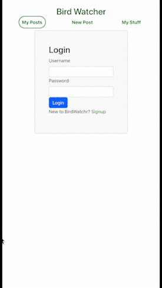
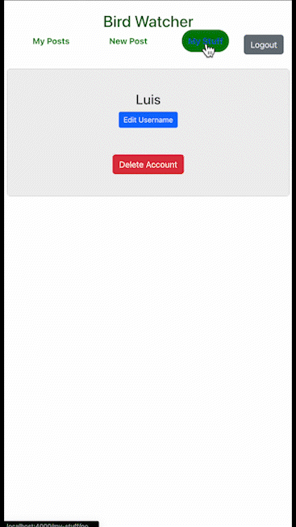

# Bird Watcher

Bird Watcher is a diary app where you can post pics and jot down notes about the interesting birds you come across.

Video Walkthrough: https://youtu.be/UCK5X_JzYVc
Demo: [https://bird-watcher-20dr.onrender.com](https://bird-watcher-20dr.onrender.com)

## Description
When the page initially loads, the user is directed to the Log in or Signup component where they will have to login or signup for an account.  They can do so by clicking on the 'Login' button in the nav bar, and then either entering in the username and password, or selecting the signup button to create a new account.  

My Posts:  Within this feed, the user can view all of the posts and notes that they have left in the past.  They can filter through their past posts by clicking on a 'My Birds' filter button on the left side to view all of their posts about a specific type of bird. They can also edit or delete a post from this component.

New Post: Within this component, the user can create a post by either selecting a bird from the dropdown menu or creating a new bird. They can then enter in a location, image_url, and caption to complete the post.

My Stuff: This component allows the user to edit/change their username and delete their account.  Once an account is deleted, all of the users posts will also be deleted.

## License

[MIT](https://choosealicense.com/licenses/mit/)
